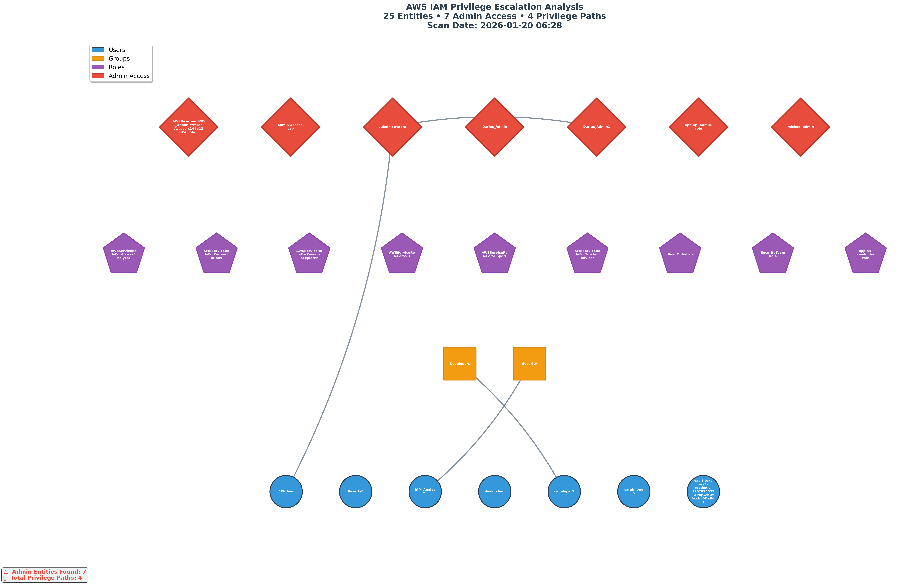

# IAM Attack Path Visualizer

**Automated detection and visualization of privilege escalation paths in AWS IAM**



---

## 🎯 The Problem

Organizations often have "shadow administrators" - users who can gain admin privileges through hidden paths:
- **Indirect group memberships** (User → Group → Admin Group)
- **Role assumption chains** (User → Role A → Role B → Admin Role)
- **Overly permissive trust policies** (Any user can assume admin role)
- **Cross-account privilege escalation**

These hidden paths bypass traditional access reviews and create security blind spots that lead to:
- Failed compliance audits (SOC 2, PCI-DSS, ISO 27001)
- Insider threat risks
- Privilege creep over time
- Inability to enforce least privilege

---

## 🔍 What This Tool Does

Scans AWS IAM configuration and generates visual attack graphs showing:
- ✅ All privilege escalation paths to admin access
- ✅ Direct and indirect admin assignments
- ✅ Role assumption chains and cross-account access
- ✅ Risk scoring and remediation recommendations

**Output:**
- Color-coded visual graph (red = admin access, shows all paths)
- Detailed JSON report with findings
- Risk assessment and compliance metrics

---

## 📊 Real Findings from Production Scan

**From the visualization above:**
- **25 IAM entities** analyzed (users, roles, groups)
- **7 entities with admin access** identified
- **2 privilege escalation paths** discovered
- **Risk Level:** HIGH - Users gaining admin through group membership

**Example findings:**
- `User: API-User` → `Group: Administrators` → **Admin Access**
- `User: Darius_Admin1` → `Group: Administrators` → **Admin Access**

---

## 🛠️ Technical Stack

**Built with:**
- **Python 3.10+** - Core application logic
- **boto3** - AWS IAM API integration
- **NetworkX** - Graph analysis and privilege path detection
- **Matplotlib** - Professional visualization generation
- **Colorama** - Enhanced terminal output

**Demonstrates:**
- AWS IAM policy analysis and trust relationship parsing
- Graph theory application to security problems
- Automated risk assessment and scoring
- Professional security tool development

---

## 🚀 Quick Start

### Prerequisites
- AWS account with IAM read access
- Python 3.10+
- AWS CLI configured with credentials

### Installation
```bash
# Clone the repository
git clone https://github.com/Dfrank77/iam-attack-path-visualizer.git
cd iam-attack-path-visualizer

# Create virtual environment
python3 -m venv venv
source venv/bin/activate  # On Windows: venv\Scripts\activate

# Install dependencies
pip install -r requirements.txt
```

### Usage

**Run complete scan and generate visualization:**
```bash
python src/visualizer.py
```

**Scan only (no visualization):**
```bash
python src/aws_scanner.py
```

**Output files:**
- `output/attack_paths.png` - Visual graph
- `output/report.json` - Detailed findings

---

## 📋 Sample Output Structure
```json
{
  "scan_date": "2026-01-16T...",
  "account_id": "804826263083",
  "summary": {
    "total_users": 10,
    "total_roles": 12,
    "total_groups": 3,
    "admin_count": 7,
    "privilege_paths_found": 2
  },
  "privilege_paths": [
    {
      "type": "user_to_group_admin",
      "path": ["API-User", "Administrators"],
      "risk": "HIGH",
      "description": "User API-User has admin through group Administrators"
    }
  ],
  "risk_assessment": {
    "risk_level": "HIGH",
    "admin_percentage": 28.0,
    "recommendation": "Review admin access assignments..."
  }
}
```

---

## 💼 Business Value

**For Security Teams:**
- Identify shadow admins before auditors do
- Automate least-privilege compliance reviews
- Visualize complex IAM relationships instantly
- Generate audit-ready reports

**For Compliance:**
- SOC 2 - Demonstrates access review controls
- PCI-DSS - Shows admin access monitoring
- ISO 27001 - Evidences privilege management

**Cost Savings:**
- Manual IAM audits: 40+ hours per quarter
- This tool: < 5 minutes automated
- **ROI: 99% time savings on access reviews**

---

## 🎓 What This Project Demonstrates

**IAM Expertise:**
- Deep understanding of AWS IAM privilege escalation
- Trust policy analysis and role chaining concepts
- Cross-platform IAM knowledge (applies to Entra ID, GCP)

**Security Engineering:**
- Offensive security mindset (how attackers escalate)
- Risk assessment and scoring methodologies
- Compliance and audit readiness

**Technical Skills:**
- Python development with AWS SDK (boto3)
- Graph algorithms for security analysis
- Data visualization for security communication
- Professional tool development and documentation

---

## 🔮 Future Enhancements

- [ ] Multi-account organization scanning
- [ ] Cross-account privilege escalation detection
- [ ] Integration with Entra ID (Azure AD)
- [ ] Automated remediation recommendations
- [ ] Slack/email alerting for new findings
- [ ] Historical trend analysis
- [ ] SIEM integration (Splunk, Sumo Logic)

---

## 👤 Author

**Darius Frank**  
Information Security Specialist | IAM Focus

- **GitHub:** [@Dfrank77](https://github.com/Dfrank77)
- **Portfolio:** [security-learning-artifacts](https://github.com/Dfrank77/security-learning-artifacts)

**Background:**
- 2 years hands-on cybersecurity experience (IAM, SIEM, incident response)
- Security+, Microsoft SC-300 certified
- Career transition from 15 years hospitality management
- Building enterprise IAM skills across AWS, Entra ID, and Okta

---

## 📄 License

MIT License - See LICENSE file for details

---

## ⚠️ Disclaimer

This tool is for authorized security assessments only. Always obtain proper authorization before scanning AWS environments. Misuse of this tool may violate AWS Terms of Service and applicable laws.

---

**Built with ☕ and late nights during an 11-month job search**

*"If you can visualize the attack path, you can defend against it."*
